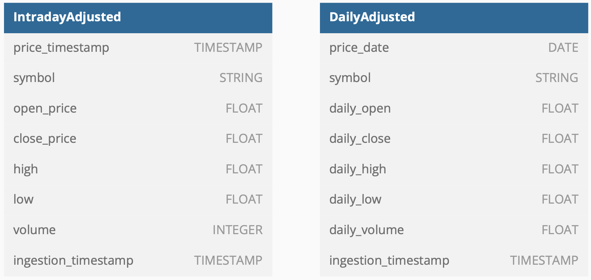

# Financial Data ETL Workflow

This project demonstrates an **ETL (Extract, Transform, Load)** workflow for processing financial data using the **Alpha Vantage API**, **Mage**, and **PostgreSQL**. The workflow is designed to fetch, transform, and store financial intraday stock data, enabling streamlined data analysis.



---

## Project Overview

### Workflow Steps
| **Step**                | **Description**                                                                              |
|-------------------------|----------------------------------------------------------------------------------------------|
| **1. Data Retrieval**   | Fetches intraday time series for the past month (1-minute intervals) for selected stocks.    |
| **2. Raw Data Storage** | Stores raw data in a PostgreSQL database with an ingestion timestamp.                        |
| **3. Data Aggregation** | Computes daily averages for key columns (open, close, high, low, volume) by date and ticker. |
| **4. Deduplication**    | Removes duplicate rows while retaining aggregated columns.                                   |
| **5. Data Export**      | Exports transformed daily data back into the database for analysis.                          |

### Database Design
Two tables are used in the database:
1. **Raw Data Table**: Stores the raw intraday stock data.
2. **Transformed Data Table**: Stores the aggregated daily averages.

---

## Local Setup Instructions

### Prerequisites
- [Alpha Vantage API Key](https://www.alphavantage.co/support/#api-key) (free registration required)
- Docker installed on your machine

### Environment Setup
1. Clone the repository:
    ```bash
    git clone https://github.com/anirudh-69/financial-data-etl-workflow.git
    cd financial-data-etl-workflow
    ```
2. Set your API key in the `.env` file:
    ```plaintext
    ALPHAVANTAGE_API_KEY=your_api_key
    ```
3. Run the project containers:
    ```bash
    docker compose up -d
    ```

### Access Services
| **Service**   | **URL**                                        | **Purpose**                      |
|---------------|------------------------------------------------|----------------------------------|
| **Mage**      | [http://localhost:6789](http://localhost:6789) | Create and monitor ETL pipelines |
| **pgAdmin**   | [http://localhost:8080](http://localhost:8080) | Manage PostgreSQL database       |

---

## Workflow Execution

### 1. Create Database Tables
- Use the `create_tables.sql` script via pgAdmin to set up the database tables.

### 2. Configure Mage
- Open Mage at [http://localhost:6789](http://localhost:6789).
- Create a new pipeline: **Adjusted Stock Data**.
- Add ETL components using provided Python scripts:
  - **API Loader**: `fetch_intraday_data.py`
  - **Raw Data Exporter**: `export_intraday_data.py`
  - **Column Transformers**: `select_columns_for_aggregation.py`, `select_columns_for_deduplication.py`
  - **Aggregator**: `compute_daily_aggregates.py`
  - **Deduplicator**: `drop_duplicates.py`
  - **Data Exporter**: `export_daily_data.py`

### 3. Run the Workflow
- Navigate to the **Pipelines** section in Mage.
- Select the pipeline and click **Run@once** to execute the workflow.

---

## Data Pipeline Overview
| **Component**          | **Purpose**                                                  |
|------------------------|--------------------------------------------------------------|
| **API Data Loader**    | Fetches intraday stock data from Alpha Vantage.              |
| **Raw Data Exporter**  | Saves raw data to the database.                              |
| **Aggregation Columns**| Selects required columns for daily aggregation.              |
| **Aggregator**         | Computes daily averages (open, close, high, low, volume).    |
| **Deduplicator**       | Drops duplicate rows from aggregated data.                   |
| **Daily Data Exporter**| Stores the cleaned and aggregated data for further analysis. |

---

## Results
- The pipeline produces a **cleaned dataset** of daily stock data, ready for analysis.
- The transformed data is stored in a PostgreSQL database for easy access.

---

## Tools Used
| **Tool**         | **Purpose**                     |
|------------------|---------------------------------|
| **Alpha Vantage**| Fetching financial stock data.  |
| **Mage**         | ETL pipeline orchestration.     |
| **PostgreSQL**   | Data storage and management.    |
| **Docker**       | Simplified containerized setup. |

---

## Contributing
Feel free to contribute by opening issues or submitting pull requests.

---

*Credits* : [Financial Data Engineering](https://www.oreilly.com/library/view/financial-data-engineering/9781098159986/) by *Tamer Khraisha*
